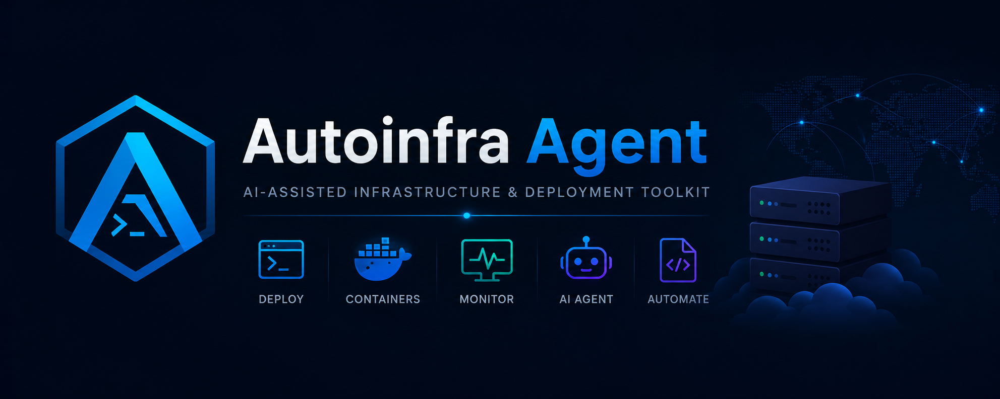

<div align="center">
  <br/>
  
  <br/>
  <br/>
  <h1>AutoInfra Agent</h1>
  <p><strong>AI-Assisted Infrastructure & Deployment Toolkit</strong></p>
  <p>
    <em>Automate your VPS, Docker, and cloud infrastructure with AI-powered workflows</em>
  </p>
  <br/>

  <!-- Badges -->
  <p>
    <a href="https://github.com/autoinfra/autoinfra-agent/releases">
      
    </a>
    <a href="https://github.com/autoinfra/autoinfra-agent/blob/main/LICENSE">
      
    </a>
    <a href="https://github.com/autoinfra/autoinfra-agent/actions">
      
    </a>
    <a href="https://nodejs.org/">
      
    </a>
    <a href="https://www.docker.com/">
      
    </a>
    <a href="https://code.visualstudio.com/">
      
    </a>
    <a href="#">
      
    </a>
    <a href="#">
      
    </a>
    <a href="#">
      
    </a>
  </p>

  <br/>

  <!-- Screenshot Preview -->
  <table>
    <tr>
      <td align="center"></td>
      <td align="center"></td>
      <td align="center"></td>
    </tr>
    <tr>
      <td align="center"><em>Dashboard Overview</em></td>
      <td align="center"><em>Deployment Workflow</em></td>
      <td align="center"><em>Container Monitoring</em></td>
    </tr>
  </table>

  <br/>

  <!-- Quick Install -->
  <pre style="background: #0f172a; color: #e2e8f0; padding: 16px; border-radius: 12px; text-align: left;">
# ▶️ Quick Start
git clone https://github.com/autoinfra/autoinfra-agent.git
cd autoinfra-agent && npm install
cp .env.example .env
npm run dev</pre>
</div>

---

## 📋 Table of Contents

- [Features Overview](#-features-overview)
- [Why AutoInfra Agent?](#-why-autoinfra-agent)
- [Architecture](#-architecture)
- [Installation](#-installation)
- [Configuration](#-configuration)
- [API Reference](#-api-reference)
- [Dashboard](#-dashboard)
- [Docker Support](#-docker-support)
- [AI Agent Integration](#-ai-agent-integration)
- [Development Workflow](#-development-workflow)
- [Example Use Cases](#-example-use-cases)
- [Screenshots](#-screenshots)
- [Roadmap](#-roadmap)
- [Contributing](#-contributing)
- [License](#-license)

---

## 🚀 Features Overview

| # | Feature | Description | Status |
|---|---------|-------------|--------|
| 1 | **AI-Assisted Deployment** | Simulate and execute multi-step deployment workflows with AI guidance | ✅ |
| 2 | **Log Analysis Utility** | Search, filter, and AI-analyze server logs for errors and insights | ✅ |
| 3 | **Docker Container Monitoring** | Real-time container status, CPU/memory stats, lifecycle events | ✅ |
| 4 | **Auto Startup Script Gen.** | Generate deployment and startup configurations automatically | ✅ |
| 5 | **Server Health Monitoring** | CPU, memory, disk, uptime tracking with alert thresholds | ✅ |
| 6 | **JSON Infrastructure API** | Full RESTful API for all infrastructure management operations | ✅ |
| 7 | **Multi-Step Task Queue** | Concurrent task execution with retry, priority, and pause/resume | ✅ |
| 8 | **AI Agent Integration** | OpenAI/Claude API integration with simulated fallback mode | ✅ |
| 9 | **Environment Config Loader** | Type-safe configuration with validation and .env support | ✅ |
| 10 | **Real-Time Terminal Logs** | WebSocket-powered log streaming with channel subscriptions | ✅ |

---

## 🤔 Why AutoInfra Agent?

### For Developers Managing VPS Servers
Stop SSH'ing into multiple servers manually. AutoInfra Agent gives you a centralized dashboard and API to monitor health, deploy updates, and analyze logs across your infrastructure — all from one place.

### For AI-Assisted Automation
Connect your OpenAI or Claude API key and get AI-powered log analysis, deployment configuration generation, health metric interpretation, and multi-step agent workflows. Works in **simulated mode** out-of-the-box so you can test everything before adding an API key.

### For Long-Context Debugging
The log viewer supports searching across large log files with AI-powered analysis. Instead of grepping through thousands of lines, let the AI identify patterns, errors, and optimization opportunities.

### For Agent-Based Task Execution
The task queue system supports concurrent processing with automatic retries — perfect for background infrastructure tasks like health checks, deployments, backups, and notifications.

### For Container Workflows
Real-time Docker monitoring with automatic container discovery, resource usage tracking, and threshold-based alerts. Works with any Docker socket.

### For VSCode / Cline Integration
The REST API is designed to be consumed by any HTTP client — including VSCode extensions, Cline CLI, and custom automation scripts. Use `curl`, `fetch`, or any language's HTTP library.

---

## 🏗 Architecture

```
┌──────────────────────────────────────────────────────────────┐
│                  HTTP Clients (Dashboard / curl / API)        │
└──────────────────────────┬───────────────────────────────────┘
                           │
┌──────────────────────────▼───────────────────────────────────┐
│                    Express Server (Node.js)                    │
│  ┌────────────┐  ┌────────────┐  ┌────────────────────────┐  │
│  │ Middleware  │  │ API Routes │  │ WebSocket Server       │  │
│  │ · Security  │  │ · /deploy  │  │ · Real-time events     │  │
│  │ · Logging   │  │ · /contain │  │ · Channel broadcast    │  │
│  │ · Rate Lim  │  │ · /health  │  │ · Ping/keep-alive      │  │
│  └────────────┘  │ · /tasks   │  └────────────────────────┘  │
│                   │ · /ai      │                              │
│                   │ · /logs    │                              │
│                   │ · /config  │                              │
│                   └─────┬──────┘                              │
└─────────────────────────┼────────────────────────────────────┘
                          │
        ┌─────────────────┼─────────────────┐
        ▼                 ▼                 ▼
┌──────────────┐ ┌──────────────┐ ┌────────────────┐
│ Task Queue   │ │Docker Monitor│ │ Health Monitor │
│ · Concurrency │ │ · Containers │ │ · CPU/Memory   │
│ · Retry logic │ │ · Stats      │ │ · Disk         │
│ · Priorities  │ │ · Alerts     │ │ · Uptime       │
└──────────────┘ └──────────────┘ └────────────────┘
        │                 │                 │
        ▼                 ▼                 ▼
┌──────────────┐ ┌──────────────┐ ┌────────────────┐
│ AI Agent     │ │ Metrics      │ │ Logger         │
│ · OpenAI API  │ │ · Requests   │ │ · Winston      │
│ · Simulation  │ │ · Time-series│ │ · Rotation     │
│ · Workflows   │ │ · Snapshots  │ │ · Files/Stdout │
└──────────────┘ └──────────────┘ └────────────────┘
```

> Full architecture details: [docs/ARCHITECTURE.md](./docs/ARCHITECTURE.md)

---

## 📦 Installation

### Prerequisites
- Node.js **>= 18.0.0**
- npm **>= 9.0.0**
- Docker (optional)

### Method 1: Quick Script (Linux/macOS)

```bash
git clone https://github.com/autoinfra/autoinfra-agent.git
cd autoinfra-agent
chmod +x scripts/setup.sh
./scripts/setup.sh
npm start
```

### Method 2: Manual (Windows / Any)

```bash
git clone https://github.com/autoinfra/autoinfra-agent.git
cd autoinfra-agent
npm install
cp .env.example .env
node scripts/generate-sample-logs.js
npm run dev
```

### Method 3: Docker Compose

```bash
git clone https://github.com/autoinfra/autoinfra-agent.git
cd autoinfra-agent
docker-compose up -d
```

### Verify Installation

```bash
# Health check
curl http://localhost:3000/health

# Dashboard
open http://localhost:3000/dashboard
```

> Detailed installation guide: [docs/INSTALL.md](./docs/INSTALL.md)

---

## ⚙️ Configuration

Configuration is managed via environment variables in `.env`. Copy `.env.example` to `.env` and customize:

```bash
cp .env.example .env
```

### Key Configuration Options

| Variable | Default | Description |
|----------|---------|-------------|
| `SERVER_PORT` | `3000` | HTTP server port |
| `SERVER_HOST` | `0.0.0.0` | Bind address |
| `NODE_ENV` | `development` | Environment mode |
| `LOG_LEVEL` | `debug` | Logging verbosity |
| `AI_API_KEY` | — | OpenAI/Claude API key |
| `AI_MODEL` | `gpt-4-turbo` | AI model to use |
| `QUEUE_CONCURRENCY` | `3` | Parallel task limit |
| `CORS_ORIGIN` | `http://localhost:3000` | Allowed CORS origin |
| `DOCKER_SOCKET` | `/var/run/docker.sock` | Docker socket path |

### Validate Configuration

```bash
curl http://localhost:3000/api/config/validate
```

---

## 📡 API Reference

All API endpoints return JSON. The API is available at `/api/`.

### System & Health

```bash
# Health check
GET /health
# Response: {"status":"ok","uptime":1234,"version":"1.2.0"}

# System status
GET /api/system/status
# Response: {"success":true,"status":{"services":{...},"containers":{...}}}

# System info
GET /api/system/info
```

### Deployments

```bash
# List deployment workflows
GET /api/deploy/workflows

# Start a deployment
POST /api/deploy
# Body: {"workflowId":"quick-deploy","target":"staging","branch":"main","environment":"staging"}

# Get deployment status
GET /api/deploy/:id

# List all deployments
GET /api/deploy

# Cancel deployment
POST /api/deploy/:id/cancel
```

### Containers

```bash
# List all containers
GET /api/containers

# Get single container
GET /api/containers/:id

# Aggregated stats
GET /api/containers/stats/summary
```

### Task Queue

```bash
# Get queue state
GET /api/tasks

# Add a task
POST /api/tasks
# Body: {"type":"health-check","data":{"target":"localhost"},"priority":1}

# Cancel a task
POST /api/tasks/:id/cancel

# Pause/resume queue
POST /api/tasks/pause
POST /api/tasks/resume
```

### AI Agent

```bash
# Check AI status
GET /api/ai/status

# Analyze logs
POST /api/ai/analyze-logs
# Body: {"logs":"ERROR: Connection timeout\nWARN: Memory high"}

# Generate deployment config
POST /api/ai/generate-deployment
# Body: {"requirements":"Node.js app with PostgreSQL"}

# Analyze health metrics
POST /api/ai/analyze-health
# Body: {"metrics":{"cpu":45,"memory":60}}

# Custom prompt
POST /api/ai/prompt
# Body: {"system":"You are a DevOps expert","message":"How do I optimize..."}

# Execute multi-step workflow
POST /api/ai/workflow
# Body: {"steps":[{"name":"Check Health","description":"..."}],"context":{}}

# Reset conversation
POST /api/ai/reset
```

### Logs

```bash
# List log files
GET /api/logs

# Read log file
GET /api/logs/:file?lines=100&search=error

# Log file statistics
GET /api/logs/:file/stats
```

### Configuration

```bash
# Get current config (sanitized)
GET /api/config

# Validate configuration
GET /api/config/validate

# List environment variables
GET /api/config/env
```

---

## 🎛 Dashboard

The web dashboard is available at `http://localhost:3000/dashboard` after starting the server.

### Dashboard Tabs

| Tab | Description |
|-----|-------------|
| **Overview** | Real-time system stats, quick actions, service status |
| **Deployments** | Workflow library, deployment history with progress bars |
| **Containers** | Docker container table with CPU/memory stats |
| **Task Queue** | Queue management, add/cancel tasks, history |
| **Health** | CPU, memory, disk, uptime monitoring |
| **Logs** | File selector, line count filter, search, log viewer |
| **AI Agent** | Log analysis, deployment generation, status indicator |
| **Configuration** | Live config viewer with JSON display |

The dashboard uses a dark theme and communicates with the server via REST API and WebSocket for real-time updates.

---

## 🐳 Docker Support

### Build & Run

```bash
# Using docker-compose (recommended)
docker-compose up -d

# Manual build
docker build -t autoinfra-agent .
docker run -d \
  -p 3000:3000 \
  -p 3001:3001 \
  -v /var/run/docker.sock:/var/run/docker.sock:ro \
  autoinfra-agent
```

### Docker Features
- Multi-stage build for minimal image size
- Health check endpoint for container orchestration
- Non-root user for security
- Volume mounts for logs and data persistence
- Docker socket mount for container monitoring
- Configurable via environment variables

---

## 🤖 AI Agent Integration

### Supported Providers

| Provider | Configuration |
|----------|--------------|
| **OpenAI** | Set `AI_API_KEY=sk-...` and `AI_PROVIDER=openai` |
| **Claude (Anthropic)** | Set `AI_API_KEY=sk-ant-...` and `AI_PROVIDER=claude` |
| **Custom (Any OpenAI-compatible)** | Set `AI_API_ENDPOINT` to your custom endpoint |

### Simulated Mode

When no API key is configured, the AI agent operates in **simulated mode**, returning realistic responses without making external API calls. This allows you to explore all features without any cost or API setup.

### AI Capabilities

1. **Log Analysis** — Paste deployment/log content and get structured analysis with error counts, pattern detection, and recommendations
2. **Deployment Configuration Generation** — Describe your stack and get ready-to-use Dockerfile, compose, and config files
3. **Health Metric Analysis** — Get AI-powered interpretation of system health data with optimization suggestions
4. **Multi-Step Workflows** — Execute complex infrastructure tasks through conversational AI guidance

### VSCode / Cline / OpenAI-Compatible API

All AI endpoints use standard HTTP/JSON and are compatible with any OpenAI API wrapper, making them accessible from:
- VSCode extensions and REST client
- Cline CLI automation
- Custom scripts using `curl`, `axios`, or `fetch`
- Any programming language with HTTP support

---

## 🔧 Development Workflow

```bash
# 1. Clone and setup
git clone https://github.com/autoinfra/autoinfra-agent.git
cd autoinfra-agent
npm install
cp .env.example .env

# 2. Generate sample data
node scripts/generate-sample-logs.js

# 3. Start development server (with auto-reload)
npm run dev

# 4. Run tests
npm test

# 5. Build Docker image
npm run docker:build
```

### Available Scripts

| Command | Description |
|---------|-------------|
| `npm start` | Production start |
| `npm run dev` | Development with nodemon |
| `npm test` | Run test suite |
| `npm run lint` | Lint and fix code |
| `npm run generate:logs` | Generate sample logs |
| `npm run docker:build` | Build Docker image |
| `npm run docker:run` | Start Docker Compose |
| `npm run docker:stop` | Stop Docker Compose |
| `npm run setup` | Run setup script |
| `npm run health` | Run health check |

---

## 💡 Example Use Cases

### 1. Deploy a Node.js Application

```bash
curl -X POST http://localhost:3000/api/deploy \
  -H "Content-Type: application/json" \
  -d '{
    "workflowId": "quick-deploy",
    "target": "prod-01.example.com",
    "branch": "release/v2.1.0",
    "environment": "production"
  }'
```

Monitor progress at `http://localhost:3000/dashboard` or via the API.

### 2. AI-Powered Log Analysis

```bash
curl -X POST http://localhost:3000/api/ai/analyze-logs \
  -H "Content-Type: application/json" \
  -d '{
    "logs": "2026-05-07 ERROR: Failed to connect to database\n2026-05-07 WARN: Memory usage at 92%\n2026-05-07 INFO: Health check passed"
  }'
```

### 3. Monitor Container Health

```bash
# Get all containers with stats
curl http://localhost:3000/api/containers

# Get summary
curl http://localhost:3000/api/containers/stats/summary
```

### 4. Queue a Background Task

```bash
curl -X POST http://localhost:3000/api/tasks \
  -H "Content-Type: application/json" \
  -d '{"type": "health-check", "data": {"target": "web-server-01"}, "priority": 5}'
```

More examples: [examples/api-usage.sh](./examples/api-usage.sh)

---

## 📸 Screenshots

> 👉 *Screenshots go here. See [screenshots/README.md](./screenshots/README.md) for details.*

| View | Preview |
|------|---------|
| **Dashboard Overview** | `screenshots/dashboard-overview.png` |
| **Deployment Workflow** | `screenshots/deployment-workflow.png` |
| **Container Monitoring** | `screenshots/container-monitoring.png` |
| **Task Queue** | `screenshots/task-queue.png` |
| **Health Monitoring** | `screenshots/health-monitoring.png` |
| **Log Viewer** | `screenshots/log-viewer.png` |
| **AI Analysis** | `screenshots/ai-analysis.png` |
| **Configuration** | `screenshots/configuration.png` |

---

## 🗺 Roadmap

| Version | Focus | Timeline |
|---------|-------|----------|
| **1.2.x** | Core features, dashboard, AI agent | ✅ Current |
| **1.3** | Database persistence, auth, notifications | Q3 2026 |
| **2.0** | Kubernetes, plugin system, multi-server | Q4 2026 |
| **2.1+** | Terraform, auto-remediation, mobile app | 2027 |

Full roadmap: [docs/ROADMAP.md](./docs/ROADMAP.md)

---

## 🤝 Contributing

We welcome contributions! Please see [CONTRIBUTING.md](./docs/CONTRIBUTING.md) for:

- Code of Conduct
- Bug reporting guidelines
- Feature request process
- Pull request workflow
- Development setup
- Code style guide
- Commit conventions

---

## 📄 License

This project is licensed under the **MIT License** — see the [LICENSE](./LICENSE) file for details.

---

<div align="center">
  <br/>
  <p>
    Made with ❤️ by the <strong>AutoInfra Team</strong><br/>
    <sub>AI-assisted infrastructure automation for everyone</sub>
  </p>
  <br/>
  <p>
    <a href="https://github.com/autoinfra/autoinfra-agent">GitHub</a> ·
    <a href="https://github.com/autoinfra/autoinfra-agent/issues">Issues</a> ·
    <a href="https://github.com/autoinfra/autoinfra-agent/discussions">Discussions</a>
  </p>
  <br/>
</div>
